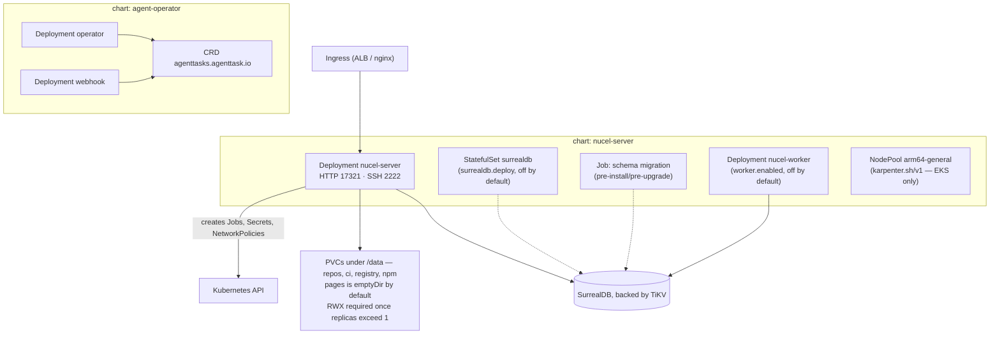

# Nucel Helm Charts

Helm charts for deploying Nucel onto Kubernetes. Two charts live here:

| Chart | Version | App version | What it deploys |
|---|---|---|---|
| [`nucel-server`](./charts/nucel-server) | 0.1.41 | 0.5.27 | The Nucel platform itself — git hosting, PRs, OCI + npm registries, Pages, CI, agent workflows. One Deployment plus its Secret/ConfigMap/PVCs and optional Ingress, SurrealDB, HPA, PDB, ServiceMonitor, NetworkPolicies. |
| [`agent-operator`](./charts/agent-operator) | 0.2.0 | 0.1.0 | The `agent-operator` controller + its webhook receiver, and the `AgentTask` CRD. |

Nucel is a self-hosted software-development platform written in Rust
([`nucel-dev/nucel`](https://github.com/nucel-dev/nucel)), backed by SurrealDB.
These charts are how it gets onto a cluster.

Read [Distribution](#distribution-read-this-before-you-install) before installing.
The chart repository the old README advertised does not currently resolve, and
these charts are not the copies running on the live cluster.

## Repo layout

```
charts/
  nucel-server/          chart 0.1.41 — the platform
    Chart.yaml
    values.yaml          308 leaf keys, heavily commented
    values-production.yaml   the documented production overlay (ESO + HA + RWX/S3)
    templates/           31 files (29 resource templates + _helpers.tpl + NOTES.txt)
    dashboards/          Grafana dashboard JSON
    README.md            per-chart reference
    PRODUCTION_HARDENING.md  required-values guard, secret generation, verification
    CLUSTER_FEATURES.md  audit of features shipped-but-unset on the live cluster
    CHANGELOG.md         per-version history (currently stops at 0.1.39)
  agent-operator/        chart 0.2.0 — the AgentTask controller
    templates/           17 files (16 resource templates + _helpers.tpl)
    dashboards/          3 Grafana dashboards (overview, webhook, costs)
    README.md            values reference
.github/workflows/
  lint.yml               helm lint + template smoke renders + secret-literal assertion
  release.yml            chart-releaser -> GitHub Releases + gh-pages index
```

There is no build step. The charts are plain Helm 3 charts with no
subchart dependencies, so there is no `Chart.lock` and nothing to vendor.

## Distribution: read this before you install

The same chart names are published from more than one place, and not every
published channel works. This is the honest state as of 2026-08-18.

| Channel | Source repo | Status |
|---|---|---|
| `https://charts.nucel.dev` | this repo, via `release.yml` | **Broken.** `charts.nucel.dev` has no DNS record — `helm repo add` fails to connect. `gh-pages` here holds a valid `index.yaml` (nucel-server up to 0.1.41, agent-operator 0.2.0) but nothing serves it: there is no `CNAME` file on `gh-pages`, and `nucel-dev.github.io/charts/index.yaml` 404s. |
| `oci://ghcr.io/nucel-dev/charts/nucel-server` | **the `nucel` repo**, via its `.github/workflows/docker.yml` on tag pushes | Active. This is the default `chart_source` for `nucel-infra`'s EKS stack. It publishes the `nucel` repo's own copy of the chart, not this one. |
| `oci://588738611061.dkr.ecr.eu-south-2.amazonaws.com/charts/*` | pushed by hand | Stale. `charts/nucel-server` carries ten tags, 0.1.0 through 0.1.9 (last pushed 2026-05-21), plus two untagged manifests. `charts/agent-operator` carries only 0.1.0. |
| Local path | this repo | What `nucel-infra`'s `neoconto` env is configured to use: `nucel_chart_source = "../../../charts/charts/nucel-server"`. |

### The two-copy problem

`nucel-server` and `agent-operator` each exist **twice**, in two different repos,
and both copies have diverged:

| Chart | This repo (`nucel-dev/charts`) | Upstream copy |
|---|---|---|
| `nucel-server` | 0.1.41 | `nucel/charts/nucel-server` at **0.1.45** |
| `agent-operator` | 0.2.0 | `agent-operator/charts/agent-operator` at **0.3.0** |

Against the `nucel` copy, this repo's `nucel-server` differs in 23 files and is
missing five: `templates/scheduler-deployment.yaml`, `templates/ssh-service.yaml`,
`templates/worker-pdb.yaml`, `values-ha.yaml`, and `values-neoconto-scale.yaml`.

The divergence has consequences you can hit today. One concrete example: this
repo's copy hardcodes the public hostname in four independent places, none of
which is derived from any other and none of which is guarded — `domain`
(`values.yaml:269`, the Ingress host), `oidc.issuer` (271, rendered as
`NUCEL_OIDC_ISSUER`), and `email.from` / `email.baseUrl` (298-299, rendered as
`NUCEL_EMAIL_FROM` / `NUCEL_BASE_URL`). All four default to `nucel.dev`, and
`.Values.domain` is referenced only by `templates/ingress.yaml`. So
`--set domain=<your-host>` fixes the Ingress host and nothing else: the OIDC
issuer and the origin baked into outbound mail still say `https://nucel.dev`.
The `nucel` copy fixed this by defaulting `domain: ""` and resolving the origin
through a `nucel.publicOrigin` helper in `_helpers.tpl` that hard-`fail`s when
neither `domain` nor `email.baseUrl` is set. Its `fail` message is worth reading
before you install this copy: `NUCEL_BASE_URL` is interpolated into
password-reset and email-verification links, so a placeholder host mails
single-use account-takeover tokens, in the query string, to a domain you do not
control.

The live `neoconto` cluster runs release `nucel` at chart **`nucel-server-0.1.44`**
— a version that has never existed in this repo (`main` is 0.1.41; `gh-pages`
tops out at 0.1.41). 0.1.44 was cut in the `nucel` repo on 2026-07-25, the same
day the release was deployed. **The running deployment is therefore not
reproducible from this repo.** `agent-operator` on that cluster runs chart 0.1.0
— one minor version behind the 0.2.0 here, and two behind the `agent-operator`
repo's 0.3.0.

Nothing automates a sync between the copies. Until that is resolved, treat the
`nucel` repo's `charts/nucel-server` as the one that ships, and this repo as the
one that publishes — they are not the same thing.

## Installing

Because the HTTPS repo does not resolve, install from a local checkout:

```bash
git clone https://github.com/nucel-dev/charts.git
cd charts
```

### nucel-server, local/dev shape

A bare `helm install` **fails by design** — the chart refuses to render without
production secrets:

```
Error: execution error at (nucel-server/templates/secret.yaml:30:24):
secrets.sessionKey is required when secrets.create=true AND
secrets.requireProductionValues=true ...
```

For a dev cluster, relax the two guards:

```bash
helm install nucel ./charts/nucel-server \
  --namespace nucel --create-namespace \
  --set secrets.requireProductionValues=false \
  --set prometheus.requireAuth=false \
  --set nodePool.create=false \
  --set domain=nucel.localhost \
  --set cookies.secure="0" \
  --set surrealdb.deploy=true
```

`nodePool.create=false` matters on anything that is not EKS — see
[Cross-environment hazards](#cross-environment-hazards-amd64-vs-arm64).

With `requireProductionValues=false` the chart generates a session key, a secret
encryption key and an SSH host key on first install, then preserves each one
across upgrades via a `lookup` of the existing Secret. Generation is a dev
convenience; rotation is never accidental.

### nucel-server, production shape

There are two production paths and they are mutually exclusive. Picking the
wrong one fails quietly rather than loudly, so be deliberate.

**Path A — External Secrets Operator owns the Secret (what the shipped overlay
does).** `values-production.yaml` sets `secrets.create: false` and
`externalSecrets.enabled: true`, and already carries a `secretStoreRef` of
`aws-secrets-manager` plus a `remoteRefs` map. Point those at your own store and
paths; you supply no secret material on the command line:

```bash
helm upgrade --install nucel ./charts/nucel-server \
  --namespace nucel --create-namespace \
  -f ./charts/nucel-server/values-production.yaml \
  --set domain=nucel.example.com \
  --set oidc.issuer=https://nucel.example.com \
  --set email.baseUrl=https://nucel.example.com \
  --set email.from='Nucel <no-reply@nucel.example.com>' \
  --set image.repository=<your-registry>/nucel-server \
  --set externalSecrets.secretStoreRef.name=<your ClusterSecretStore> \
  --set storage.classes.pages.s3.bucket=<bucket> \
  --set storage.classes.gitWorkspaces.s3.bucket=<bucket>
```

The three hostname values after `domain` are not optional decoration. Omit them
and the render still succeeds, but `NUCEL_OIDC_ISSUER`, `NUCEL_BASE_URL` and
`NUCEL_EMAIL_FROM` all come out as `nucel.dev` — see
[the two-copy problem](#the-two-copy-problem) for why they are four separate
values here.

Because `secrets.create` is false on this path, any `--set secrets.*` you pass
alongside the overlay is **silently ignored** — the chart renders an
`ExternalSecret` and no `Secret` at all. That is the intended behaviour (two
owners for one Secret name would fight), but it does mean a command that looks
like it seeded credentials may not have.

**Path B — the chart manages the Secret.** Do not use the overlay; supply the
material directly and leave `secrets.requireProductionValues` at its default so
the guard enforces all four keys:

```bash
helm upgrade --install nucel ./charts/nucel-server \
  --namespace nucel --create-namespace \
  --set domain=nucel.example.com \
  --set oidc.issuer=https://nucel.example.com \
  --set email.baseUrl=https://nucel.example.com \
  --set email.from='Nucel <no-reply@nucel.example.com>' \
  --set image.repository=<your-registry>/nucel-server \
  --set nodePool.create=false \
  --set secrets.sessionKey="$(openssl rand -hex 64)" \
  --set secrets.secretEncryptionKey="$(openssl rand -hex 32)" \
  --set secrets.oidcPrivateKey="$(openssl genpkey -algorithm ED25519)" \
  --set secrets.metricsToken="$(openssl rand -base64 32)"
```

Part of the overlay's HA posture is already in the base defaults, so this path
gets it for free: the PodDisruptionBudget (`minAvailable: 1`) and the two-axis
`topologySpreadConstraints` across `kubernetes.io/hostname` and
`topology.kubernetes.io/zone` render identically here and under the overlay.
What is genuinely overlay-only is the HPA and its bounds, the two
PriorityClasses, `ReadWriteMany` PVCs and the S3 storage classes, and the
ServiceMonitor + PrometheusRule. Add those yourself or copy them out of
`values-production.yaml`.

`PRODUCTION_HARDENING.md` covers the required-values guard, secret generation and
the post-install verification checklist for both.

### Values enforced at install time

These use Helm's `required`/`fail` and abort the render rather than deploying
something broken:

| Value | Gated by | Generate with |
|---|---|---|
| `secrets.sessionKey` | `secrets.create` + `secrets.requireProductionValues` | `openssl rand -hex 64` |
| `secrets.secretEncryptionKey` | same | `openssl rand -hex 32` |
| `secrets.oidcPrivateKey` | same | `openssl genpkey -algorithm ED25519` |
| `secrets.metricsToken` | `prometheus.requireAuth` (default true) | `openssl rand -base64 32` |
| `basicAuth.password` | `basicAuth.enabled` and no `existingSecret` | any secret string |
| `externalSecrets.secretStoreRef.name` | `externalSecrets.enabled` | your `ClusterSecretStore` name |
| `externalSecrets.remoteRef.key` **or** `remoteRefs` | `externalSecrets.enabled` | remote key(s) holding the `NUCEL_*` values |

`secrets.secretEncryptionKey` is the AES-256-GCM master key for the secret vault.
Rotating it makes every previously stored BYOK credential and CI secret
permanently undecryptable. Set it once and preserve it.

### agent-operator

```bash
helm install agent-operator ./charts/agent-operator \
  --namespace agent-operator-system --create-namespace \
  --set config.github.auth=pat \
  --set secrets.githubToken=<token> \
  --set secrets.anthropicApiKey=<key>
```

It renders with no values at all (both Secrets come out with zero data keys),
which is useful for `helm template` but not a working install.

Note the chart installs **one** CRD, `agenttasks.agenttask.io`. The
`prreviewtasks.agenttask.io` CRD that exists on the live cluster is not in this
copy of the chart — it ships in the `agent-operator` repo's 0.3.0 chart.

## What `nucel-server` renders

A relaxed-dev render with default values produces:

```
1  Deployment            nucel-server (HTTP 17321 + SSH 2222)
1  Service               ClusterIP, both ports
1  ConfigMap             non-secret NUCEL_* config
2  Secret                <release>-nucel-server-secrets (ns nucel)
                         nucel-ci-runner-secret (ns nucel-ci)
4  PersistentVolumeClaim repos / ci-data / registry / npm
2  Namespace             nucel + nucel-ci
1  ServiceAccount        IRSA/Workload-Identity annotatable
1  ClusterRole + Binding pipelinejobruns, batch/jobs, secrets, networkpolicies
                         — the server's entire K8s write surface
1  Job                   pre-install/pre-upgrade schema migration
1  PodDisruptionBudget   minAvailable 1
1  NodePool              karpenter.sh/v1 — EKS only, see below
```

Opt-in on top of that: Ingress, in-chart SurrealDB StatefulSet, HPA, standalone
worker Deployments and worker pools, ServiceMonitor, PrometheusRule, Grafana
dashboard ConfigMap, NetworkPolicies, PriorityClasses, ExternalSecret, a
fake-data seed Job, and preview-environment namespace + RBAC.



Note the chart does **not** own everything the platform needs. On the live
cluster SurrealDB is managed by OpenTofu (`nucel-infra/modules/surrealdb`), which
is why `surrealdb.deploy` defaults to `false` — two owners for one StatefulSet
would fight.

## Storage model

The chart picks a backend per data class rather than one global setting, because
several classes must be readable by every replica:

| Class | Default | Multi-replica requirement |
|---|---|---|
| `pages` | `emptyDir` | `s3`, or a ReadWriteMany PVC |
| `registry` | `pvc` (RWO) | ReadWriteMany PVC — no S3 driver in the binary |
| `npm` | `pvc` (RWO) | ReadWriteMany PVC — no S3 driver |
| `artifacts` | `pvc` (RWO) | ReadWriteMany PVC — no S3 driver |
| `gitWorkspaces` | `pvc` (RWO) | ReadWriteMany PVC; `s3` adds a cold tier, local PVC stays as hot cache |
| `workspaces` | `emptyDir` | fine as-is (CI scratch) |

The defaults are single-replica-safe, not multi-replica-safe. The chart enforces
this rather than letting you find out in production — asking for two replicas on
the defaults aborts the render:

```
storage.classes.pages.backend=emptyDir cannot be shared across 2 replicas
(HPA: false) — each pod gets its own empty volume, causing the data-loss /
404-race in #244. Use backend=s3 (pages) or a ReadWriteMany PVC.
```

The same guard rejects a ReadWriteOnce PVC on a shared class under
`replicas > 1` or an enabled HPA, and rejects `backend: s3` on `registry`, `npm`
or `artifacts` because the server has no S3 driver for those.

On AWS the RWX answer is EFS. On Hetzner you need to bring your own RWX
provisioner (NFS, CephFS, Longhorn) — there is no default.

## Cross-environment hazards: amd64 vs arm64

Both charts are shared between an arm64 EKS environment and an amd64 Hetzner
environment. Two defaults in `nucel-server` are written for the EKS side and
will hurt you elsewhere, and a third bites the `agent-operator` chart. Check all
three when porting an install.

**1. `nodePool.create` defaults to `true` and is EKS-only.**

The default render emits:

```yaml
apiVersion: karpenter.sh/v1
kind: NodePool
metadata:
  name: arm64-general
spec:
  template:
    spec:
      nodeClassRef:
        group: eks.amazonaws.com
        kind: NodeClass
        name: default
      requirements:
        - key: kubernetes.io/arch
          operator: In
          values: [arm64]
```

That references the Karpenter CRD *and* the EKS Auto Mode `NodeClass` API group.
On a cluster without Karpenter — every Hetzner cluster — the apply fails on an
unknown kind. Even on a Karpenter cluster, Helm cannot adopt a NodePool it did
not create, so if the platform layer already owns one you get a conflict.
`nucel-infra` documents this explicitly and overrides the default to `false`:

> Whether the chart should template its Karpenter NodePool (`nodePool.create`).
> Default false: a NodePool is cluster/platform infra, owned by the EKS layer
> (or applied out-of-band), not the app release — helm cannot adopt a
> pre-existing unmanaged NodePool. Hetzner has no Karpenter, so false there too.

Set `nodePool.create=false` on anything that is not a greenfield EKS Auto Mode
cluster.

**2. The seed Job is pinned to arm64.**

`seed.nodeSelector` defaults to `kubernetes.io/arch: arm64`, because the EKS
general pool is arm64-only. On an amd64 cluster the seed Job is scheduled
against nodes that do not exist and sits `Pending` forever. Override
`seed.nodeSelector` (or clear it) when `seed.enabled=true` off EKS.

**3. `agent-operator` ships no `nodeSelector` at all.**

Both Deployments in `charts/agent-operator/values.yaml` default to
`nodeSelector: {}` (lines 57 and 76). This is the one hazard here with a
recorded incident behind it. `nucel-infra` commit `1324f47`
("fix(neoconto): pin agent-operator to arm64 nodes") records that on the
mixed-arch `neoconto` cluster the operator Deployment sat in `ImagePullBackOff`
for over three days and 20k+ retries: the images carried only a `linux/arm64`
manifest, the empty selector let the scheduler put the pod on one of the amd64
nodes, and the webhook came up only because it happened to land on an arm64 one.
That fix was applied in `nucel-infra`, not here — the live Deployments now carry
`kubernetes.io/arch: arm64` while this chart still defaults to `{}`. Pin it
yourself on any mixed-arch cluster.

Beyond those three: `values-production.yaml` sizes the HPA ceiling (30) to the
arm64 NodePool's 100-CPU limit, the ingress annotation examples assume the AWS
Load Balancer Controller, and `serviceAccount.annotations` examples assume IRSA.
None of those break a Hetzner install, but none of them help it either.

## Local development

All you need is Helm 3.12+ (verified against 4.2.3). There is nothing to compile.

```bash
# lint both charts
for c in charts/*/; do helm lint "$c"; done

# render the dev shape
helm template t charts/nucel-server \
  --set secrets.requireProductionValues=false \
  --set prometheus.requireAuth=false

# render the production overlay exactly as CI does
helm template t charts/nucel-server \
  -f charts/nucel-server/values-production.yaml \
  --set externalSecrets.secretStoreRef.name=aws-secrets-manager \
  --set storage.classes.pages.s3.bucket=some-bucket \
  --set storage.classes.gitWorkspaces.s3.bucket=some-bucket

# check a single template
# --show-only errors out if the template renders nothing, so a conditional
# template needs whatever toggle gates it — here surrealdb.networkPolicy.
helm template t charts/nucel-server \
  --set secrets.requireProductionValues=false \
  --set prometheus.requireAuth=false \
  --set surrealdb.deploy=true \
  --set surrealdb.networkPolicy.enabled=true \
  --show-only templates/surrealdb-networkpolicy.yaml
```

To reproduce the full gate locally, work through the steps in
`.github/workflows/lint.yml` — it is the authoritative list.

## CI and releases

**`lint.yml`** runs on PRs and pushes to `main` touching `charts/**`. It does
more than lint, and it is worth knowing what it asserts before you change a
template:

- `helm lint` on every chart.
- `helm template` smoke renders of `nucel-server` in four shapes: relaxed-dev,
  production-values, full-HA with every toggle on, and the
  `values-production.yaml` overlay exactly as it ships.
- Value assertions, not just resource presence — HPA min/max bounds,
  `topologySpread` across both hostname and zone, the system PriorityClass on
  the server pod, and at least four `ReadWriteMany` PVCs in HA shapes.
- Both SurrealDB NetworkPolicy shapes (in-chart ingress lock-down and external
  egress lock-down), plus the two negative cases: no over-broad policy when
  `deploy=false` with no `externalPeers`, and fail-fast on the silent-no-op
  combination of `networkPolicy.enabled` + `allowAllOtherEgress=false`.
- The storage guard genuinely rejecting RWO under HPA.
- `agent-operator` in default and HA shapes.
- A secret-literal assertion: with no secret values supplied, no conditional
  secret key may render with a value. This is what stops a placeholder from
  becoming a shipped credential.

**`release.yml`** runs `helm/chart-releaser-action` on pushes to `main`. It
packages every chart, creates a GitHub Release per chart version with the `.tgz`
attached, and updates `index.yaml` on `gh-pages`. `skip_existing: true` keeps it
idempotent — a push touching one chart would otherwise 422 on the others'
already-published releases and abort the reindex.

Never commit packaged `.tgz` files or hand-edit `index.yaml`. CI owns those and
`.gitignore` blocks them from `main`.

Note that publishing succeeding is not the same as the chart being installable:
the release pipeline works, but the domain it publishes to does not resolve.

## Contributing

1. Branch from `origin/main`. A worktree keeps this clean:
   ```bash
   git fetch --prune origin
   git worktree add ../charts-my-change -b fix/my-change origin/main
   ```
2. Edit under `charts/<chart>/`.
3. **Bump `version` in `Chart.yaml`.** The release pipeline keys off it; without
   a bump, `skip_existing` silently skips your change and nothing publishes.
4. Add a `CHANGELOG.md` entry for `nucel-server` (the file currently stops at
   0.1.39 and needs catching up).
5. Run the lint and template checks above locally.
6. If you touch a template that CI asserts on, update `lint.yml` in the same PR.
7. Open a PR. `lint.yml` gates it.

If your change also belongs in the `nucel` repo's copy of `nucel-server` (or the
`agent-operator` repo's copy), port it there too and say so in the PR — nothing
syncs them automatically, and the copy that ships to the live cluster is
currently the other one.

## Documentation

Per-chart docs live next to each chart:

- [`charts/nucel-server/README.md`](./charts/nucel-server/README.md) — values
  reference, quickstart, SurrealDB topology, AW runner dispatch, upgrade notes.
  Partly stale: its header still cites chart 0.1.15 / app 0.5.9.
- [`charts/nucel-server/PRODUCTION_HARDENING.md`](./charts/nucel-server/PRODUCTION_HARDENING.md)
  — required-values guard, secret generation, SurrealDB network isolation, and
  the post-install verification checklist.
- [`charts/nucel-server/CLUSTER_FEATURES.md`](./charts/nucel-server/CLUSTER_FEATURES.md)
  — audit of features whose code ships but whose effect was disabled on the live
  cluster by an unset value or Secret, with the operator action for each.
- [`charts/nucel-server/CHANGELOG.md`](./charts/nucel-server/CHANGELOG.md)
- [`charts/agent-operator/README.md`](./charts/agent-operator/README.md) — full
  values reference, monitoring setup, install examples.

Platform and application docs live in
[`nucel-dev/nucel`](https://github.com/nucel-dev/nucel) under `docs/`.
Infrastructure that consumes these charts lives in `nucel-infra`
(`modules/nucel-app`, `modules/agent-operator`, `stacks/eks`, `stacks/hetzner`).

## Known gaps

Recorded so nobody rediscovers them the hard way.

- **`charts.nucel.dev` does not resolve.** No DNS record, no `CNAME` on
  `gh-pages`. Every install instruction that starts with `helm repo add` fails
  today.
- **Two diverged copies of both charts** in other repos, with no sync
  automation. The live cluster runs a `nucel-server` version that does not exist
  here.
- **Four separate values default to `nucel.dev`, and none is guarded** in this
  copy: `domain`, `oidc.issuer`, `email.from` and `email.baseUrl`. `domain`
  drives only the Ingress host — it is referenced nowhere but
  `templates/ingress.yaml` — so setting it alone leaves `NUCEL_OIDC_ISSUER` and
  the `NUCEL_BASE_URL` that outbound password-reset links are built from still
  pointing at `nucel.dev`. The `nucel` repo's copy fixed this by deriving the
  origin from `domain` and failing the render when neither it nor
  `email.baseUrl` is set; this one has not.
- **`metrics.serviceMonitor.*` is inert.** It defaults to `enabled: true` but no
  template consumes it — the only key that creates a ServiceMonitor is
  `prometheus.serviceMonitor.enabled`, which defaults to `false`. CI does not
  catch this because it sets both. Similarly, `metrics.alerts` and
  `prometheus.alerts` render two different PrometheusRule resources.
- **Duplicate legacy/new value blocks.** `autoscaling.*` and `hpa.*` both drive
  the HPA; `podDisruptionBudget.*` and `pdb.*` both drive the PDB. Either set
  enables the resource. Prefer `hpa.*` and `pdb.*` on new installs.
- **`basicAuth` comment in `values.yaml` is wrong.** It claims `kube-probe` and
  `ELB-HealthChecker` User-Agents bypass the gate. That bypass was deliberately
  removed from `nucel-server` as a security hole — exemption is decided by path
  only, and `/health` and `/readyz` are already exempt by path, so probes stay
  green regardless.
- **`CHANGELOG.md` stops at 0.1.39** while `Chart.yaml` is at 0.1.41.
- **`charts/nucel-server/README.md` header cites 0.1.15 / 0.5.9**, several
  releases behind.
- The ECR OCI mirrors are stale (`nucel-server` 0.1.0–0.1.9, `agent-operator`
  0.1.0) and should not be treated as a distribution channel.

## License

MIT — see [LICENSE](./LICENSE). The `agent-operator` chart declares
Apache-2.0 in its `Chart.yaml` annotations, matching its upstream project.
